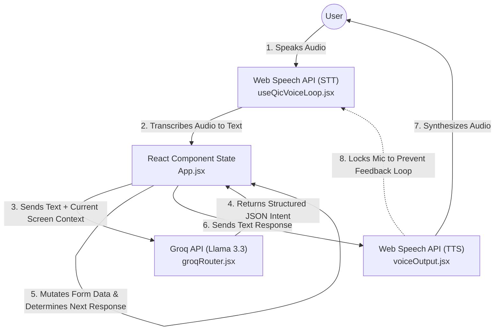
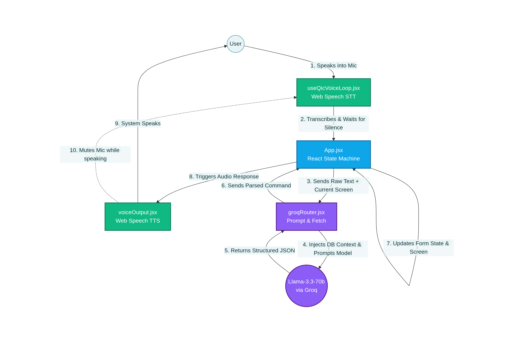

HEAD
# insurance-voice-ai-assistant

# Kavya Premium Insurance - Voice-First AI Assistant 🎙️

Welcome to the **Kavya Premium Insurance** repository! This project is a fully autonomous, voice-guided enterprise insurance enrollment portal. 

## 1. 🎯 Purpose

What started as an experimental project to help my daughter complete her homework by speaking and auto-correcting her English instead of typing, quickly evolved into an enterprise-grade use case. 

Future generations are not going to tolerate long, tedious forms. They expect seamless, conversational, and voice-guided interfaces. The purpose of this project is to demonstrate how a traditional form-based flow can be transformed into a **Voice-First AI Experience**, reducing friction and making customer onboarding accessible and conversational.

## 2. 🏗️ Architecture & Technology Stack

The system utilizes a **Native Client-Side State Machine Architecture**. By running natively in React and leaning on browser APIs, it eliminates the need for a complex backend, ensuring rapid state updates and high security.

* **Frontend:** React.js (Vite)
* **Speech-to-Text (STT):** Browser-native Web Speech API (`SpeechRecognition`)
* **Text-to-Speech (TTS):** Browser-native Web Speech API (`SpeechSynthesis`)
* **AI Intelligence:** Meta's `llama-3.3-70b-versatile` via **Groq API** for ultra-low latency intent extraction.
* **API Communication:** Native Javascript `fetch` API.

### Technology Stack Interaction Map
The following diagram illustrates how the technology stack components communicate with each other during a user interaction loop.



## 3. 🚀 Developer Support: Installation & Execution

Follow these steps to run the application locally.

### Prerequisites
* **Node.js** (v18+ recommended)
* A free **Groq API Key** (Get one at [console.groq.com](https://console.groq.com/keys))

### Setup Instructions

1. **Clone the Repository**
   ```bash
   git clone <repository-url>
   cd kavya-insurance-voice
   ```

2. **Install Dependencies**
   ```bash
   npm install
   ```

3. **Configure Environment Variables**
   Create a `.env` file in the root directory and add your Groq API Key:
   ```bash
   VITE_GROQ_API_KEY=your_groq_api_key_here
   ```

4. **Run the Development Server**
   ```bash
   npm run dev
   ```

5. **Test the Application**
   Open your browser to `http://localhost:5173`. Click the **Floating Mic Icon** in the bottom right, allow microphone permissions, and start speaking!

## 4. 🧩 Component Breakdown & Data Flow

The codebase is highly modularized for easy maintenance:

* **`src/App.jsx` (The Heart):** The central state machine. It tracks the `activeScreen` and `formData`. It receives JSON commands from Groq, instantly updates the UI, and dictates the flow sequence. It also acts as the fallback for manual keyboard/mouse inputs.
* **`src/hooks/useQicVoiceLoop.jsx` (The Ears):** A custom React Hook managing the Web Speech API. It includes a 2.5-second silence debouncer to ensure users finish their sentences (or long ID numbers) before sending the payload. It strictly manages the mic state, including auto-muting after 1 minute of complete silence.
* **`src/service/groqRouter.jsx` (The Brain):** The bridge to the Groq API. It takes raw text, current screen context, and dictionary schemas, then prompts Llama 3.3 to extract intents into strict JSON payloads. 
* **`src/utils/voiceOutput.jsx` (The Mouth):** Controls the `SpeechSynthesis` engine. When it talks, it locks the system (`sysSpeaking = true`) so the microphone doesn't accidentally transcribe the system's own voice.



## 5. ✨ Unique Captures & Features

* **⚡ Ultra-Low Latency Inference:** Leveraging Groq's LPU architecture, AI intent extraction occurs in milliseconds, creating a real-time conversational loop.
* **🔄 Seamless Hybrid Input:** Users are never locked into voice. They can speak their phone number, but type their car model, and click "Next" with a mouse. The state merges flawlessly.
* **🧠 Fault-Tolerant NLP & Phonetic Autocorrect:** If a user says "Ultima", the system phonetically maps it to "Altima" using the injected `CAR_DATA` schema.
* **🗣️ Human-Error Handling:** The AI prompt explicitly instructs the LLM to ignore stumbles. If a user says, *"My number is 3344... wait no, delete that, it's 55667788,"* the system elegantly extracts only the final corrected value.
* **🎙️ Smart Mic Management:** Features a live-transcript overlay, a dynamic toggle, and an inactivity auto-mute (1 minute) to ensure privacy and battery performance.
7700d7d (Initial Commit)
